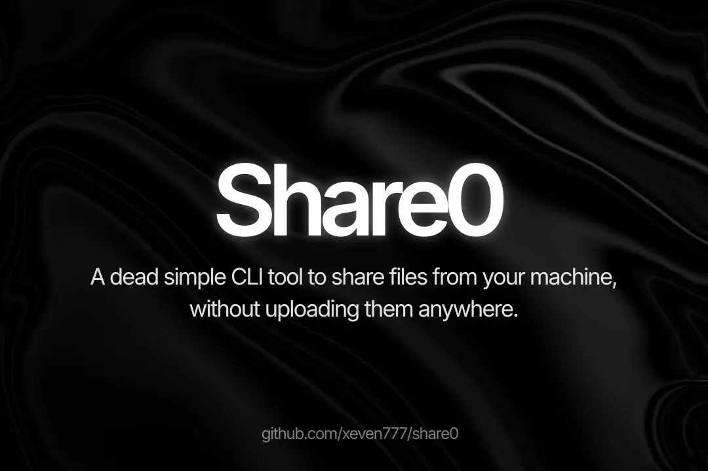

<p align="center">
  <h1 align="center">share0</h1>
  <p align="center"><strong>A Dead Simple CLI tool to share files from your machine, without uploading them anywhere.</strong></p>
  <p align="center">One command. A link and a QR code. Any browser can download. No account. No cloud.</p>
</p>
<p align="center">
  <a href="https://github.com/Xeven777/share0/stargazers"></a>
  <a href="https://github.com/Xeven777/share0/network/members"></a>
  <a href="https://github.com/Xeven777/share0/releases"></a>
  <a href="https://github.com/Xeven777/share0/issues"></a>
  <a href="https://github.com/Xeven777/share0/blob/main/LICENSE"></a>
</p>



<p align="center">
  <video src="https://github.com/user-attachments/assets/d97056a5-f66b-4efa-a28b-48484ab52d1b" controls width="100%">
    Your browser does not support the video tag.
  </video>
</p>

<p align="center">
  <a href="https://bun.sh"></a>
  
  
</p>

<p align="center">
  <a href="#-quick-start">Quick start</a> •
  <a href="#-usage">Usage</a> •
  <a href="#-how-it-works">How it works</a> •
  <a href="#-troubleshooting">Troubleshooting</a> •
  <a href="#-contributing">Contributing</a>
</p>

---

```bash
share0 send ./video.mp4
```

```text
Local  http://192.168.1.42:8787/a8Fd
QR     scan with your phone camera
Done   link is in your clipboard
Press Ctrl+C to stop
```

That is the whole flow. If the devices share Wi-Fi, the bytes move over your network and never touch a third party server. Kill the command and the share dies.

If this saves you a WeTransfer upload, please [star the repo](https://github.com/Xeven777/share0). It helps more than you think.

## ✨ Why people like it

- 📂 **Send anything.** Single files, multiple files, full directories. Add `--zip` to serve a directory as one archive.
- ⚡ **Starts at once, resumes on drop.** The server streams from disk with HTTP Range support. A 20 GB video never loads fully into memory.
- 📱 **Phones just work.** The recipient scans a QR code and downloads in the browser. No app, no login.
- 🌍 **Public when you need it.** Add `--public` and share0 opens a free tunnel, checks `/health` through it, and prints only links that answer.
- 🔒 **Private when you need it.** Short passwords like `482-719`, expiry like `30m`, download limits like `--downloads 1`.
- 🩺 **Fixes its own network issues.** `share0 doctor` checks ports, firewalls, IPv6, UPnP, and tunnel binaries and prints the exact fix.

## 🚀 Quick start

Install the binary:

```bash
curl -fsSL https://raw.githubusercontent.com/Xeven777/share0/main/scripts/install.sh | bash
```

Or download it manually from [Releases](https://github.com/Xeven777/share0/releases) and put it on your PATH.

Run from source with [Bun](https://bun.sh) 1.1 or newer:

```bash
bun install
bun run apps/cli/index.ts send ./file.mp4
```

## 📖 Usage

### Send files

```bash
share0 send ./photo.jpg
share0 send file1.jpg file2.jpg
share0 send ./project
share0 send ./project --zip
share0 send secret.pdf --password
share0 send secret.pdf --password 482719
share0 send ./video.mp4 --expires 30m
share0 send ./video.mp4 --downloads 1
share0 send ./video.mp4 --upnp
share0 send ./video.mp4 --public
share0 send ./video.mp4 --public --tunnel pinggy
share0 send ./video.mp4 --qr=off
share0 send ./video.mp4 --no-p2p
share0 send ./video.mp4 --detach
share0
```

Bare `share0` opens an interactive menu. `--tunnel` accepts `auto`, `ask`, `pinggy`, `localxpose`, `cloudflare`, `localtunnel`, `localhost.run`, `zrok`. `--qr` accepts `all`, `local`, `public`, `off`.

### Receive files

Turn your machine into a drop box. Someone else pushes files to you.

```bash
share0 receive
share0 receive --dir ./share-inbox
share0 receive --port 9000
share0 receive --password
share0 receive --public                    # reachable from any network
share0 receive --public --as anish         # publish a reusable handle
share0 receive --public --code             # publish a 3-character code
```

Push straight to a receive endpoint:

```bash
share0 send ./report.pdf --to http://192.168.1.10:8788
```

### Inbox mode: send by name

This is optional. It exists to avoid pasting tunnel URLs into chat apps, and
it is the only feature in share0 that needs a server.

The receiver publishes a name, the sender uses it.

On the receiving machine, once:

```bash
share0 hub                                # on any always-on machine (see below)
export SHARE0_HUB=https://your-hub.example

share0 receive --public --as anish
```

```text
Saving to  ./share-inbox

Public
  https://bumpy-waves-raise.loca.lt  (via localtunnel)

Send to this inbox
  share0 send ./file --to anish
```

On the sending machine, any time after:

```bash
share0 send ./holiday.zip --to anish
```

```text
Looking up "anish" on https://your-hub.example…
  → anish (receive) is online.
Pushing 1 file(s) to https://bumpy-waves-raise.loca.lt…
  ✓ holiday.zip (1.2 GB)
Delivered 1 file(s).
```

If you send to the same person often, you type their name instead of a link.
Use `--code` instead of `--as` for a 3-character handle you can read aloud
once, such as `K7M`.

Directories are archived automatically, so `--to anish ./photos` works.

A name resolves only while the receiver is running. Receivers refresh their
entry every 10 minutes and the hub drops anything unrefreshed after 30, so a
stopped process stops resolving on its own. You do not have to clean up stale
names. A push also checks that the inbox answers before it starts, so a name
whose tunnel died in the meantime fails with a clear message instead of
hanging.

#### The hub

The hub maps a name to a live URL. It never handles file bytes and stores
nothing about your files.

Run your own:

```bash
share0 hub --host 0.0.0.0                 # port 8790, in-memory
```

Or deploy it as a Cloudflare Worker, which serves the same routes over
Workers KV. Run these from the repo root, not from `hub/`:

```bash
cd hub
npx wrangler kv namespace create SHARE0   # paste the printed id into wrangler.toml
npx wrangler deploy
```

`bun run hub:deploy` does the same thing and handles the directory for you.
Wrangler refuses to run from the repo root because the root `package.json`
declares workspaces.

Set `SHARE0_HUB` on both machines to point at it. There are no accounts.

The Worker free tier allows 1,000 KV writes per day. A receiver refreshing
every 10 minutes spends 144 of them, so several inboxes fit on the free tier.

The hub has no authentication. Anyone who knows its address can claim a name
and anyone can look one up. Do not treat a name as a secret.

### Discover, list, stop, diagnose

```bash
share0 discover   # find nearby shares and receivers on the LAN
share0 list       # show running shares
share0 stop a8Fd  # kill one share
share0 doctor     # check network, firewall, and tunnels
```

## 🔧 How it works

Your machine serves. The browser downloads. It needs no database and no accounts. Exit the CLI and the share ends.

| Transport | When share0 uses it | How it moves bytes |
|---|---|---|
| LAN | Same Wi-Fi or cable, the default | Direct HTTP to your LAN IP |
| IPv6 | Both sides have direct IPv6 | Direct HTTP to your IPv6 address |
| UPnP | You pass `--upnp` | Short lived router port mapping, removed on exit |
| WebRTC P2P | Offered by default, uses UDP 52000 to 52100 | Browser DataChannel with STUN for NAT traversal |
| Tunnel | You pass `--public` | Free tunnel adapter, link checked with `/health` before display |

Tunnel adapters today include Pinggy, LocalXpose, Cloudflare quick tunnel, LocalTunnel, localhost.run, and zrok. Pinggy free sessions run about 60 minutes and suit most temporary links. zrok free allows 5 GB per day and suits small shares. share0 skips dead links and tries the next provider.

### share0 vs the usual tools

| Task | Cloud upload tools | share0 |
|---|---|---|
| Send a 10 GB video | Wait for upload, then wait for download, pay for storage | Stream it from disk, start at once, pay nothing |
| Share on home Wi-Fi | Still round trips through a data center | Moves over LAN at LAN speed |
| Share with a phone | Ask them to install an app and make an account | They scan a QR code in the camera app |
| End access | Hope the expiry setting worked | Press Ctrl+C, the server stops, the URL dies |

## ❓ Troubleshooting

<details>
<summary><strong>Phone cannot open the LAN URL on the same Wi-Fi</strong></summary>

Work through this list in order.

1. Confirm the phone uses Wi-Fi, not mobile data, with no VPN active.
2. Skip guest, hotel, and office networks. Many block device to device traffic.
3. Check the laptop firewall. `share0 doctor` flags a blocked port and prints the fix.
4. The CLI prints every LAN IP it finds. Try each one.
5. If you switched networks after starting, restart the share. The CLI warns when your IP changes.

Fix a blocked port 8787:

```bash
sudo ufw allow 8787/tcp
```

```bash
sudo firewall-cmd --add-port=8787/tcp --permanent
sudo firewall-cmd --reload
```

</details>

<details>
<summary><strong>Pinggy shows a warning page</strong></summary>

That is Pinggy free link screening. The recipient taps Enter site once and the download page loads. Curl clients skip it.

</details>

<details>
<summary><strong>Tunnel link returns 404</strong></summary>

Some providers hand out a URL before edge routing exists. share0 requests `/health` through each tunnel and prints only links that answer. Dead links never print.

</details>

<details>
<summary><strong>SSH asks for a password for Pinggy</strong></summary>

Press Enter. Empty input is the documented answer for free tunnels.

</details>

<details>
<summary><strong>The P2P button does nothing</strong></summary>

The browser must reach the signaling URL first. Symmetric NAT often blocks UDP hole punching. Plain download still works. To open the P2P port range on ufw:

```bash
sudo ufw allow 52000:52100/udp
```

</details>

## 🗺️ Roadmap

- [x] LAN sharing with QR codes and clipboard copy
- [x] Streaming with HTTP Range resume
- [x] Passwords, expiry, download limits, ZIP mode
- [x] Free tunnel adapters with verified links
- [x] UPnP port mapping and WebRTC P2P offer
- [x] Receive mode and LAN discovery
- [x] Inbox mode: hub handles, `receive --public`, `send --to <name>`
- [ ] Sender-minted 3-character codes (`send --pair`) for one-off shares
- [ ] PWA receiver and installable share pages
- [ ] Optional end-to-end encryption
- [ ] Native desktop and mobile wrappers

Have an idea? [Open an issue](https://github.com/Xeven777/share0/issues/new) or send a PR.

## 🤝 Contributing

Contributions are welcome. Big feature? Open an issue first so we agree on scope.

```bash
git clone https://github.com/Xeven777/share0.git
cd share0
bun install
bun test
bun run apps/cli/index.ts doctor
```

Please run `bun test` before pushing. Keep transport vendors behind the adapter interface in `packages/transport`, and keep `packages/core` free of vendor imports.

## 🙏 Acknowledgements

Built with [Bun](https://bun.sh). Tunneling via [Pinggy](https://pinggy.io), [LocalXpose](https://localxpose.io), [Cloudflare](https://developers.cloudflare.com/cloudflare-one/networks/connectors/cloudflare-tunnel/), [LocalTunnel](https://github.com/localtunnel/localtunnel), [localhost.run](https://localhost.run), and [zrok](https://zrok.io). Inspired by the original `share-cli` idea of a tiny local server plus a tunnel.

## 📄 License

MIT. See [LICENSE](LICENSE).
